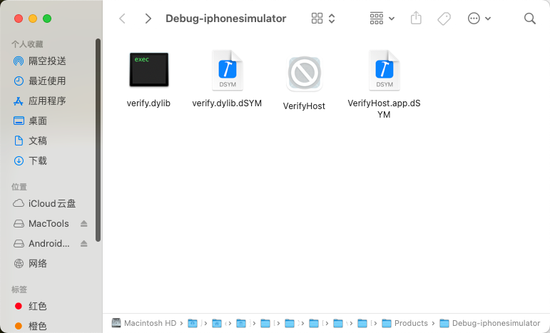
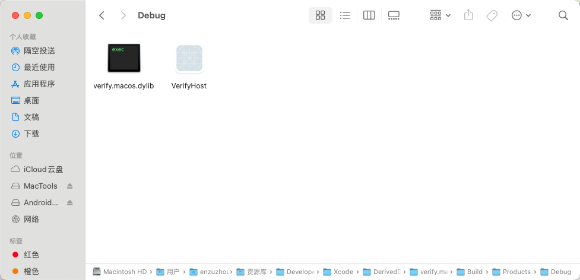
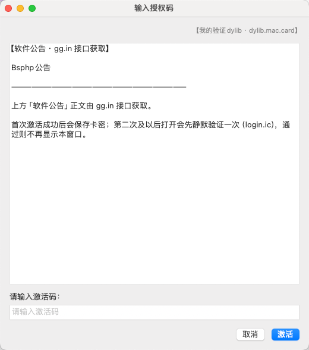

# BSPHP · Apple iOS / macOS Demo

[www.bsphp.com](https://www.bsphp.com)

---

## 目录 · Table of contents

| Language | Section |
|----------|---------|
| 简体中文 | [简体中文](#简体中文) |
| 繁體中文 | [繁體中文](#繁體中文) |
| English | [English](#english) |

---

## 简体中文

### 简介

本仓库提供在 **iOS** 与 **macOS** 上对接 **BSPHP 验证系统** 的示例工程，涵盖独立 App 与 **动态库（dylib）** 弹窗激活等场景，便于集成到自有产品或给客户试用版加验证。

[BSPHP](https://www.bsphp.com) 为 **软件会员 / 收费后端**：您专注开发软件与订阅体验，**会员与授权管理** 交由 BSPHP；支持 **账号密码注册**，亦可 **充值卡一键激活**。

### 示例工程一览

| 目录 | 说明 |
|------|------|
| `bsphp.app.demo.card` | iOS：**卡密 / 充值卡** 模式演示 App |
| `bsphp.app.demo.user` | iOS：**账号登录** 模式演示 App |
| `bsphp.mac.demo` | macOS：**账号** 模式演示（SwiftUI 等，详见目录内说明） |
| `bsphp.mac.demo.card` | macOS：**卡密** 模式演示 |
| `dylib.verify.oc` | iOS **dylib**：Objective-C，弹窗输入激活码；含 **VerifyHost**，用于调试注入与调用动态库 |
| `dylib.verify.macos` | macOS **dylib**：同上思路，OC 版，VerifyHost 调试 |
| `dylib.mac.card` | macOS **dylib**：**Swift** 弹窗验证示例，适合在已写好的程序中嵌入验证逻辑，给客户测试版使用 |
| `dylib.ios.card` | iOS **dylib**：**Swift** 同上，适合嵌入既有工程给客户测试版使用 |

### 各工程目录内说明文档（三语 Markdown）

每个示例目录内另有 **目录结构、配置、内嵌截图** 等说明，文件名为：

`说明中文.md` · `说明繁体.md` · `说明英文.md`

### 演示站 · 购卡、订单与充值卡

购买、订单展示、领取充值卡等可在 **演示后台与接口** 中查看，例如：

| 说明 | 演示链接 |
|------|----------|
| 续费 / 相关列表（演示） | [salecard_renew · list](https://demo.bsphp.com/index.php?m=webapi&c=salecard_renew&a=list) |
| 生成卡相关（演示） | [salecard_gencard · list](https://demo.bsphp.com/index.php?m=webapi&c=salecard_gencard&a=list) |
| 售卡相关（演示） | [salecard_salecard · list](https://demo.bsphp.com/index.php?m=webapi&c=salecard_salecard&a=list) |

具体字段与业务流程以 BSPHP 官方文档与后台配置为准。

### 构建结果与编译产物路径

1. 使用 **Xcode** 打开对应 `.xcodeproj` 或 workspace，选择 Scheme 后 **Product → Build**（或 **Run**）即可编译。
2. 在 Xcode 中打开当前工程的构建目录：**Product → Show Build Folder in Finder**（在 Finder 中打开 Derived Data 下本工程的 **Build** 文件夹）。
3. 常见产物位置（具体名称因工程与配置而异）：`Build/Products/Debug/`、`Build/Products/Debug-iphoneos/`、`Build/Products/Release/` 等；**dylib**、**app**、**framework** 等会出现在对应子目录中。

### 项目预览

以下为各工程目录内 **配置说明截图**（通常取 `效果图-配置说明/1.png` 或 `配置说明/1.png`）。完整步骤与更多图见该目录下的 `说明中文.md`、`说明繁体.md`、`说明英文.md`。

#### `bsphp.app.demo.card` — iOS 卡密 / 充值卡演示

[说明中文](bsphp.app.demo.card/说明中文.md) · [说明繁体](bsphp.app.demo.card/说明繁体.md) · [说明英文](bsphp.app.demo.card/说明英文.md)

#### `bsphp.app.demo.user` — iOS 账号登录演示

[说明中文](bsphp.app.demo.user/说明中文.md) · [说明繁体](bsphp.app.demo.user/说明繁体.md) · [说明英文](bsphp.app.demo.user/说明英文.md)

#### `bsphp.mac.demo` — macOS 账号模式演示

[说明中文](bsphp.mac.demo/说明中文.md) · [说明繁体](bsphp.mac.demo/说明繁体.md) · [说明英文](bsphp.mac.demo/说明英文.md)

#### `bsphp.mac.demo.card` — macOS 卡密演示

[说明中文](bsphp.mac.demo.card/说明中文.md) · [说明繁体](bsphp.mac.demo.card/说明繁体.md) · [说明英文](bsphp.mac.demo.card/说明英文.md)

#### `dylib.verify.oc` — iOS dylib（Objective-C）

[说明中文](dylib.verify.oc/说明中文.md) · [说明繁体](dylib.verify.oc/说明繁体.md) · [说明英文](dylib.verify.oc/说明英文.md) · [说明.md](dylib.verify.oc/说明.md)

#### `dylib.verify.macos` — macOS dylib（Objective-C）

[说明中文](dylib.verify.macos/说明中文.md) · [说明繁体](dylib.verify.macos/说明繁体.md) · [说明英文](dylib.verify.macos/说明英文.md) · [说明.md](dylib.verify.macos/说明.md)

#### `dylib.mac.card` — macOS dylib（Swift）

[说明中文](dylib.mac.card/说明中文.md) · [说明繁体](dylib.mac.card/说明繁体.md) · [说明英文](dylib.mac.card/说明英文.md) · [README.md](dylib.mac.card/README.md)

#### `dylib.ios.card` — iOS dylib（Swift）

[说明中文](dylib.ios.card/说明中文.md) · [说明繁体](dylib.ios.card/说明繁体.md) · [说明英文](dylib.ios.card/说明英文.md)

---

## 繁體中文

### 簡介

本倉庫提供在 **iOS** 與 **macOS** 上對接 **BSPHP 驗證系統** 的範例工程，涵蓋獨立 App 與 **動態庫（dylib）** 彈窗啟用等場景，便於整合至自有產品或為客戶試用版加入驗證。

[BSPHP](https://www.bsphp.com) 為 **軟體會員／收費後端**：您專注開發軟體與訂閱體驗，**會員與授權管理** 交由 BSPHP；支援 **帳號密碼註冊**，亦可 **儲值卡一鍵啟用**。

### 範例專案一覽

| 目錄 | 說明 |
|------|------|
| `bsphp.app.demo.card` | iOS：**卡密／儲值卡** 模式示範 App |
| `bsphp.app.demo.user` | iOS：**帳號登入** 模式示範 App |
| `bsphp.mac.demo` | macOS：**帳號** 模式示範（詳見目錄內說明） |
| `bsphp.mac.demo.card` | macOS：**卡密** 模式示範 |
| `dylib.verify.oc` | iOS **dylib**（Objective-C）：彈窗輸入啟用碼；含 **VerifyHost**，用於除錯注入與呼叫動態庫 |
| `dylib.verify.macos` | macOS **dylib**：同上思路，OC 版，VerifyHost 除錯 |
| `dylib.mac.card` | macOS **dylib**（**Swift**）：嵌入既有程式、客戶測試版驗證 |
| `dylib.ios.card` | iOS **dylib**（**Swift**）：同上，iOS 測試版驗證 |

### 各工程目錄內說明文件（三語 Markdown）

各範例目錄內另有 **目錄結構、設定、內嵌截圖** 等說明，檔名為：

`说明中文.md` · `说明繁体.md` · `说明英文.md`

### 演示後台與介面 · 購卡、訂單與儲值卡

購買、訂單展示、領取儲值卡等可於 **演示後台與介面** 參考，例如：

| 說明 | 演示連結 |
|------|----------|
| 續費／相關列表（演示） | [salecard_renew · list](https://demo.bsphp.com/index.php?m=webapi&c=salecard_renew&a=list) |
| 產生卡相關（演示） | [salecard_gencard · list](https://demo.bsphp.com/index.php?m=webapi&c=salecard_gencard&a=list) |
| 售卡相關（演示） | [salecard_salecard · list](https://demo.bsphp.com/index.php?m=webapi&c=salecard_salecard&a=list) |

實際欄位與流程以 BSPHP 官方文件與後台設定為準。

### 建置結果與編譯產物路徑

1. 以 **Xcode** 開啟對應 `.xcodeproj` 或 workspace，選擇 Scheme 後 **Product → Build**（或 **Run**）即可編譯。
2. 在 Xcode 中開啟建置資料夾：**Product → Show Build Folder in Finder**（於 Finder 中開啟 Derived Data 下本專案之 **Build** 資料夾）。
3. 常見產物位置（依工程與設定而異）：`Build/Products/Debug/`、`Build/Products/Debug-iphoneos/`、`Build/Products/Release/` 等；**dylib**、**app**、**framework** 等位於對應子目錄。

### 專案預覽

以下為各工程目錄內 **設定說明截圖**（通常為 `效果图-配置说明/1.png` 或 `配置说明/1.png`）。完整步驟與更多圖見該目錄下之 `说明中文.md`、`说明繁体.md`、`说明英文.md`。

#### `bsphp.app.demo.card` — iOS 卡密／儲值卡示範

[说明中文](bsphp.app.demo.card/说明中文.md) · [说明繁体](bsphp.app.demo.card/说明繁体.md) · [说明英文](bsphp.app.demo.card/说明英文.md)

#### `bsphp.app.demo.user` — iOS 帳號登入示範

[说明中文](bsphp.app.demo.user/说明中文.md) · [说明繁体](bsphp.app.demo.user/说明繁体.md) · [说明英文](bsphp.app.demo.user/说明英文.md)

#### `bsphp.mac.demo` — macOS 帳號模式示範

[说明中文](bsphp.mac.demo/说明中文.md) · [说明繁体](bsphp.mac.demo/说明繁体.md) · [说明英文](bsphp.mac.demo/说明英文.md)

#### `bsphp.mac.demo.card` — macOS 卡密示範

[说明中文](bsphp.mac.demo.card/说明中文.md) · [说明繁体](bsphp.mac.demo.card/说明繁体.md) · [说明英文](bsphp.mac.demo.card/说明英文.md)

#### `dylib.verify.oc` — iOS dylib（Objective-C）

[说明中文](dylib.verify.oc/说明中文.md) · [说明繁体](dylib.verify.oc/说明繁体.md) · [说明英文](dylib.verify.oc/说明英文.md) · [说明.md](dylib.verify.oc/说明.md)

#### `dylib.verify.macos` — macOS dylib（Objective-C）

[说明中文](dylib.verify.macos/说明中文.md) · [说明繁体](dylib.verify.macos/说明繁体.md) · [说明英文](dylib.verify.macos/说明英文.md) · [说明.md](dylib.verify.macos/说明.md)

#### `dylib.mac.card` — macOS dylib（Swift）

[说明中文](dylib.mac.card/说明中文.md) · [说明繁体](dylib.mac.card/说明繁体.md) · [说明英文](dylib.mac.card/说明英文.md) · [README.md](dylib.mac.card/README.md)

#### `dylib.ios.card` — iOS dylib（Swift）

[说明中文](dylib.ios.card/说明中文.md) · [说明繁体](dylib.ios.card/说明繁体.md) · [说明英文](dylib.ios.card/说明英文.md)

---

## English

### Introduction

This repository contains sample projects that integrate **BSPHP verification** on **iOS** and **macOS**: standalone apps and **dylib** activation flows, so you can embed licensing in your product or ship trial builds to customers.

[BSPHP](https://www.bsphp.com) is a **software membership and billing backend**: you build the app and subscription UX; **license / member management** runs on BSPHP. Users may **sign up with account and password**, or **activate with a prepaid card in one step**.

### Project map

| Folder | Description |
|--------|-------------|
| `bsphp.app.demo.card` | iOS demo: **card / prepaid key** flow |
| `bsphp.app.demo.user` | iOS demo: **account login** flow |
| `bsphp.mac.demo` | macOS demo: **account** mode (see in-folder docs) |
| `bsphp.mac.demo.card` | macOS demo: **card** mode |
| `dylib.verify.oc` | iOS **dylib** (Objective-C): activation dialog; **VerifyHost** for injection debugging |
| `dylib.verify.macos` | macOS **dylib**: same idea, Objective-C, VerifyHost |
| `dylib.mac.card` | macOS **dylib** (**Swift**): embed in apps / trial builds |
| `dylib.ios.card` | iOS **dylib** (**Swift**): same for iOS trial builds |

### Trilingual Markdown in each folder

Each sample folder includes **structure, configuration, and embedded screenshots** in:

`说明中文.md` · `说明繁体.md` · `说明英文.md`

### Demo backend and APIs

Purchases, order views, and card redemption are illustrated in the demo admin and web APIs, for example:

| Topic | Link |
|-------|------|
| Renewals / related list (demo) | [salecard_renew · list](https://demo.bsphp.com/index.php?m=webapi&c=salecard_renew&a=list) |
| Card generation (demo) | [salecard_gencard · list](https://demo.bsphp.com/index.php?m=webapi&c=salecard_gencard&a=list) |
| Card sales (demo) | [salecard_salecard · list](https://demo.bsphp.com/index.php?m=webapi&c=salecard_salecard&a=list) |

Field names and business rules follow BSPHP official docs and your server configuration.

### Build output and paths

1. Open the `.xcodeproj` or workspace in **Xcode**, choose a Scheme, then **Product → Build** (or **Run**).
2. Open the build folder: **Product → Show Build Folder in Finder** (Derived Data → this project’s **Build** folder).
3. Products (apps, **dylibs**, frameworks, etc.) usually appear under `Build/Products/Debug`, `Debug-iphoneos`, `Release`, etc., depending on scheme and platform.

### Project previews

**Setup screenshots** from each sample (first image in `效果图-配置说明` or `配置说明`). Full steps and more figures are in that folder’s `说明中文.md`, `说明繁体.md`, and `说明英文.md`.

#### `bsphp.app.demo.card` — iOS card / prepaid key demo

[说明中文](bsphp.app.demo.card/说明中文.md) · [说明繁体](bsphp.app.demo.card/说明繁体.md) · [说明英文](bsphp.app.demo.card/说明英文.md)

#### `bsphp.app.demo.user` — iOS account login demo

[说明中文](bsphp.app.demo.user/说明中文.md) · [说明繁体](bsphp.app.demo.user/说明繁体.md) · [说明英文](bsphp.app.demo.user/说明英文.md)

#### `bsphp.mac.demo` — macOS account mode demo

[说明中文](bsphp.mac.demo/说明中文.md) · [说明繁体](bsphp.mac.demo/说明繁体.md) · [说明英文](bsphp.mac.demo/说明英文.md)

#### `bsphp.mac.demo.card` — macOS card mode demo

[说明中文](bsphp.mac.demo.card/说明中文.md) · [说明繁体](bsphp.mac.demo.card/说明繁体.md) · [说明英文](bsphp.mac.demo.card/说明英文.md)

#### `dylib.verify.oc` — iOS dylib (Objective-C)

[说明中文](dylib.verify.oc/说明中文.md) · [说明繁体](dylib.verify.oc/说明繁体.md) · [说明英文](dylib.verify.oc/说明英文.md) · [说明.md](dylib.verify.oc/说明.md)

#### `dylib.verify.macos` — macOS dylib (Objective-C)

[说明中文](dylib.verify.macos/说明中文.md) · [说明繁体](dylib.verify.macos/说明繁体.md) · [说明英文](dylib.verify.macos/说明英文.md) · [说明.md](dylib.verify.macos/说明.md)

#### `dylib.mac.card` — macOS dylib (Swift)

[说明中文](dylib.mac.card/说明中文.md) · [说明繁体](dylib.mac.card/说明繁体.md) · [说明英文](dylib.mac.card/说明英文.md) · [README.md](dylib.mac.card/README.md)

#### `dylib.ios.card` — iOS dylib (Swift)

[说明中文](dylib.ios.card/说明中文.md) · [说明繁体](dylib.ios.card/说明繁体.md) · [说明英文](dylib.ios.card/说明英文.md)

---

*BSPHP is a third-party verification / licensing system; configure API endpoints, keys, and policies on your own BSPHP deployment.*
