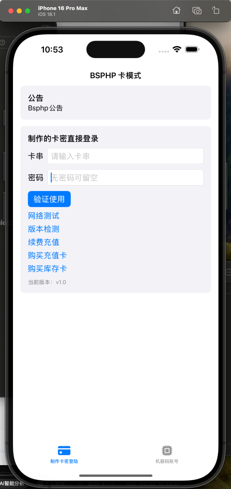
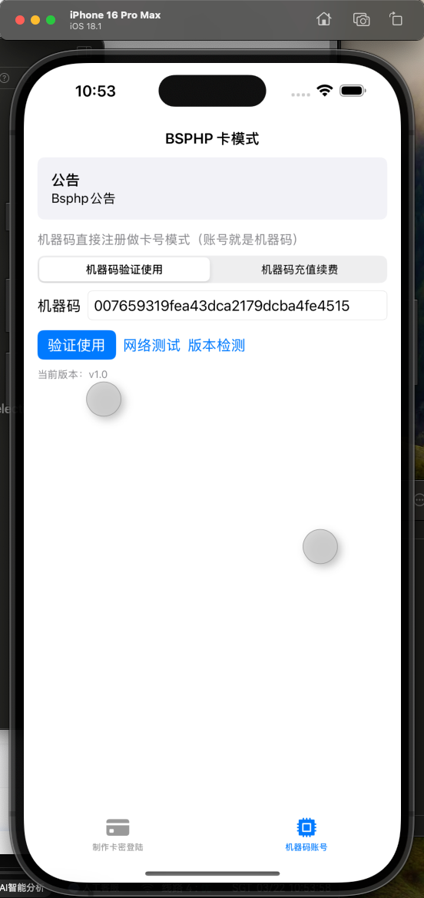
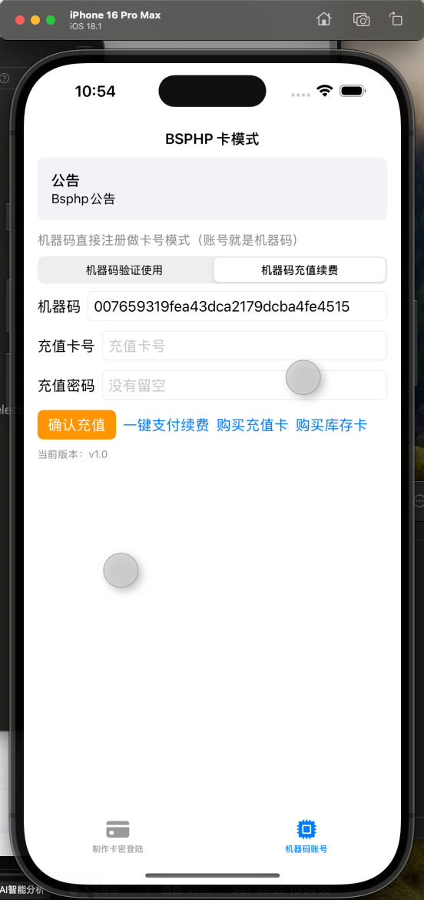
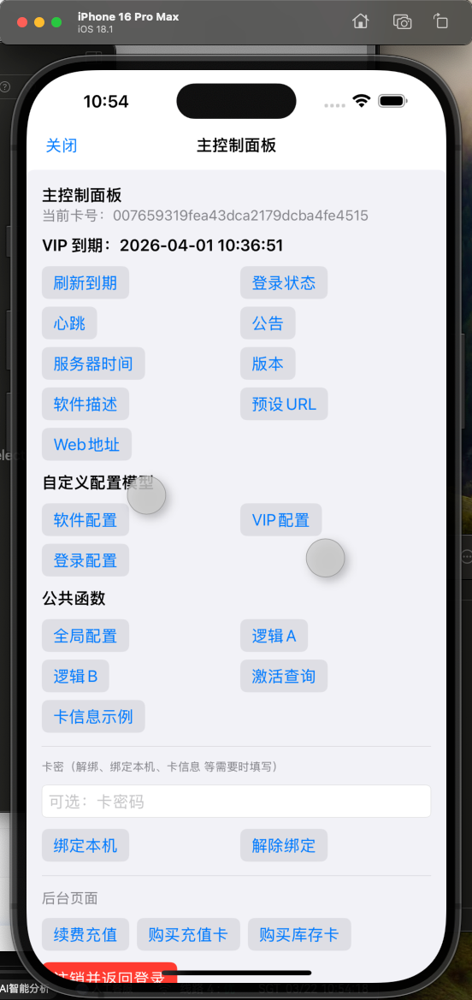
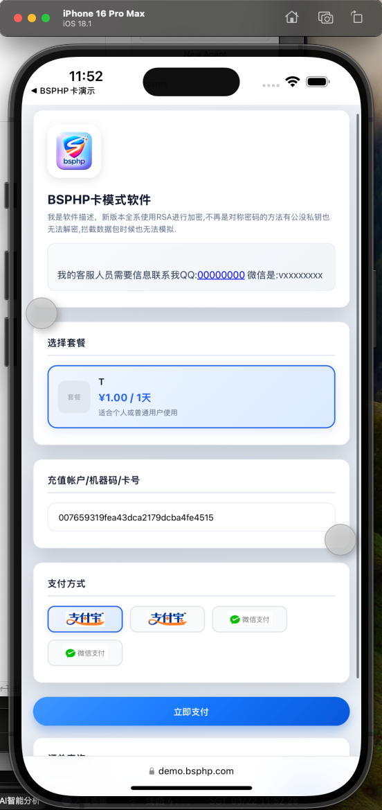
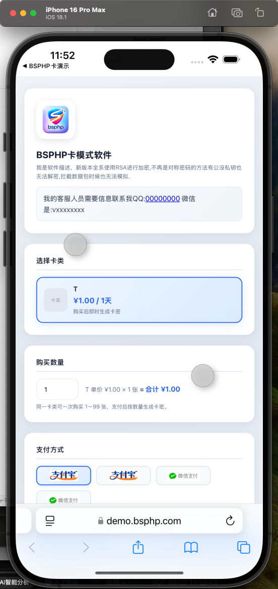
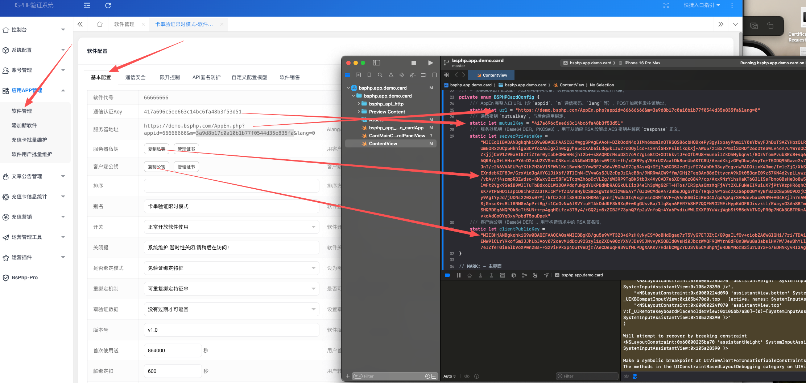
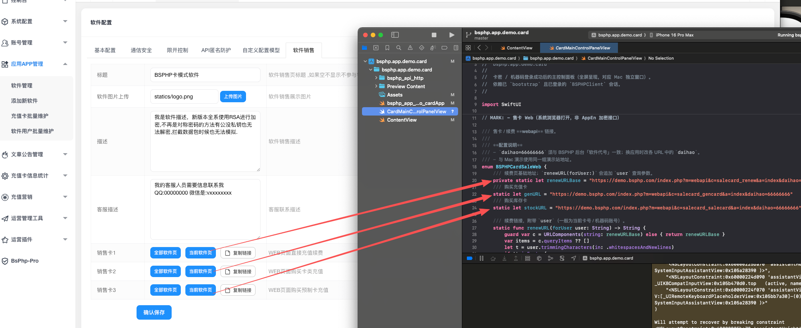

# BSPHP — bsphp.app.demo.card（iOS 卡模式演示 App）

## 專案簡介

演示 BSPHP 充值卡／卡密登入與相關介面的 iOS 應用（SwiftUI）。須與後台「當前應用」的 AppEn 位址、mutualKey、RSA 金鑰一致。

## 目錄結構

```
bsphp.app.demo.card/
├── bsphp.app.demo.card.xcodeproj/     Xcode 專案
├── bsphp.app.demo.card/               主 Target 原始碼
│   ├── bsphp_app_demo_cardApp.swift   App 進入點
│   ├── ContentView.swift              主介面、BSPHPCardConfig
│   ├── CardMainControlPanelView.swift 登入後控制台（續費／購卡連結等）
│   ├── bsphp_api_http/                BSPHPClient、BSPHPCrypto
│   ├── Assets.xcassets/
│   └── Preview Content/
├── bsphp.app.demo.cardTests/
├── bsphp.app.demo.cardUITests/
├── 效果图-配置说明/
├── 说明中文.md / 说明繁体.md / 说明英文.md
└── （建置產物在 DerivedData）
```

## 主要目錄說明

| 路徑 | 說明 |
|------|------|
| `bsphp.app.demo.card.xcodeproj/` | 以 Xcode 開啟 |
| `bsphp.app.demo.card/` | 卡模式介面與 `BSPHPCardConfig` |
| `bsphp_api_http/` | 與 AppEn.php 通訊與加密 |
| `效果图-配置说明/` | 後台設定示意截圖 |

## 設定說明

1. 編輯 `bsphp.app.demo.card/ContentView.swift` 中私有列舉 **BSPHPCardConfig**：`url`、`mutualKey`、`serverPrivateKey`、`clientPublicKey`（須與後台同一應用配套）。
2. 售卡／續費連結：檢查 `CardMainControlPanelView.swift` 中 **BSPHPCardSaleWeb** 的 `daihao` 等與後台「軟體代號」一致。
3. Xcode 選擇主 App Scheme，執行目標為 iOS 模擬器或已簽名真機。

## 設定說明截圖

















## 建置產物

**Xcode**：**Product → Show Build Folder in Finder**，在對應 Configuration 下尋找 `.app`。
