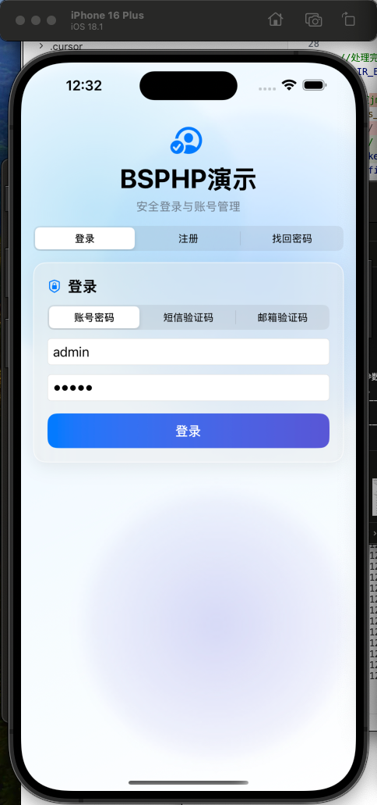
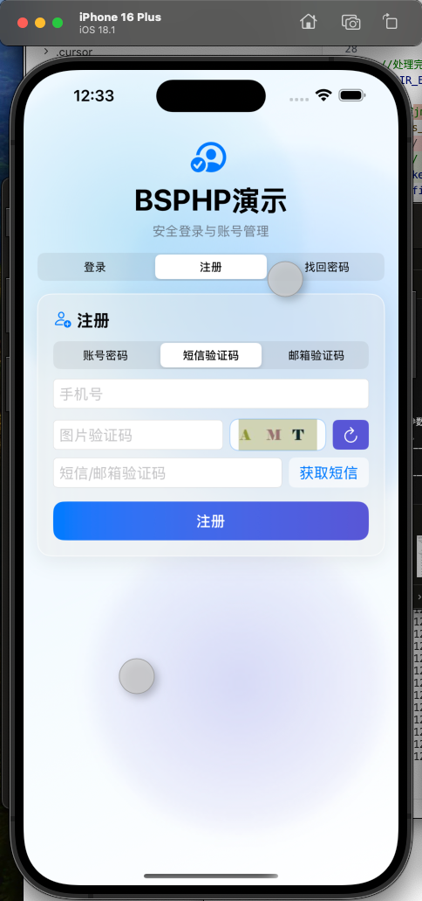
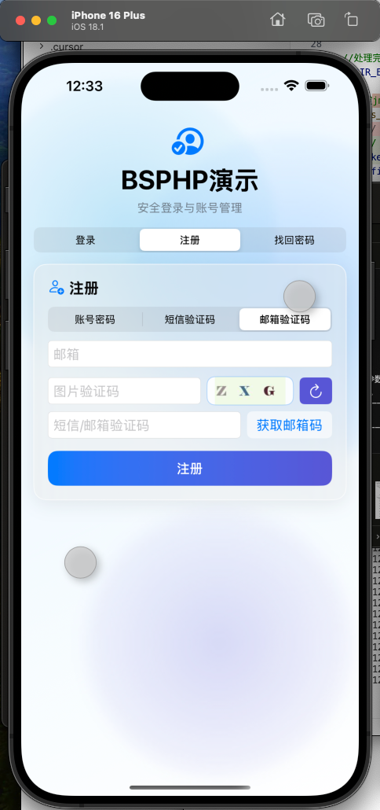
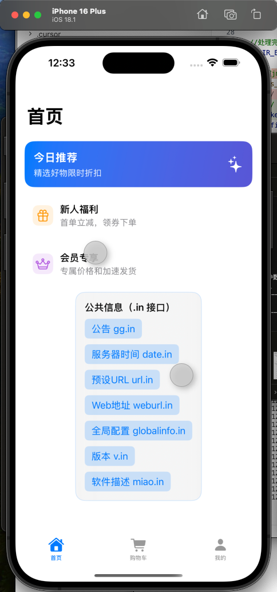
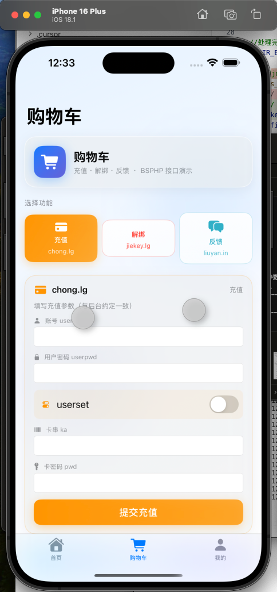
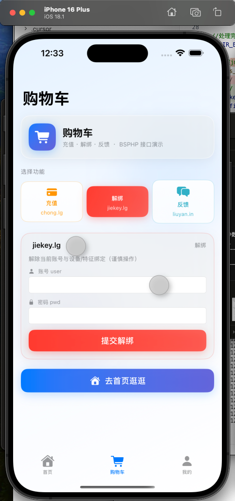
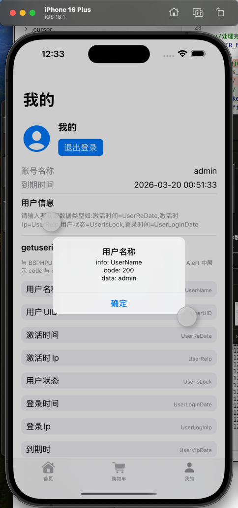
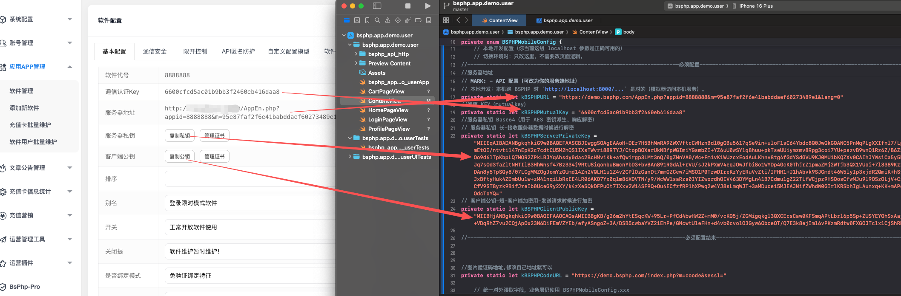

# BSPHP — bsphp.app.demo.user（iOS 账号登录模式演示 App）

## 项目简介

演示 BSPHP 账号注册、登录、验证码、充值等能力的 iOS 应用（SwiftUI）。服务端地址、mutualKey、RSA 及验证码前缀须与后台同一应用一致。

## 目录结构

```
bsphp.app.demo.user/
├── bsphp.app.demo.user.xcodeproj/
├── bsphp.app.demo.user/
│   ├── bsphp_app_demo_userApp.swift
│   ├── ContentView.swift              BSPHPMobileConfig（API 配置）
│   ├── bsphp_api_http/
│   ├── Assets.xcassets/
│   └── Preview Content/
├── bsphp.app.demo.userTests/
├── bsphp.app.demo.userUITests/
├── 效果图-配置说明/
├── 说明中文.md / 说明繁体.md / 说明英文.md
└── （构建产物在 DerivedData）
```

## 主要说明

- **ContentView.swift** 内 **BSPHPMobileConfig**：`url`、`mutualKey`、`RSA`、`codeURLPrefix`。
- **bsphp_api_http/**：网络与加密；对接演示后台时通常无需改协议层。

## 配置说明

编辑 `bsphp.app.demo.user/ContentView.swift` 中 **BSPHPMobileConfig** 的常量，与 BSPHP 后台「当前应用」的 AppEn、通信 KEY、RSA 密钥对、验证码图片地址前缀一致。

## 配置说明截图

















## 构建产物

**Product → Show Build Folder in Finder**。
