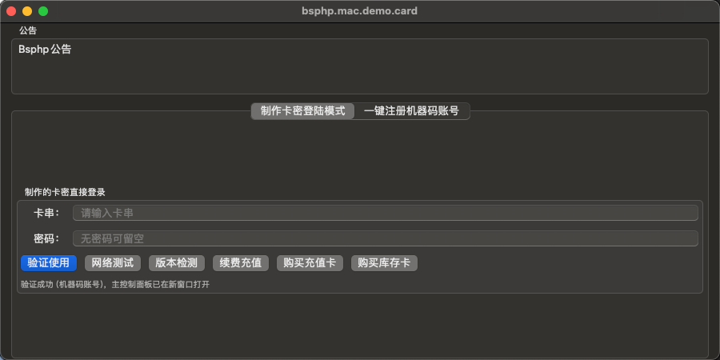
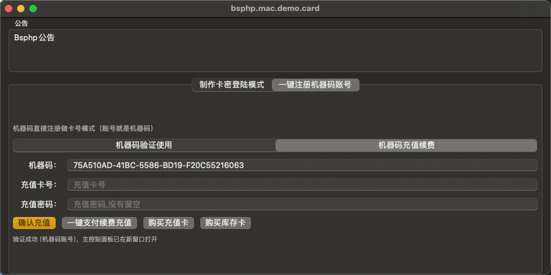
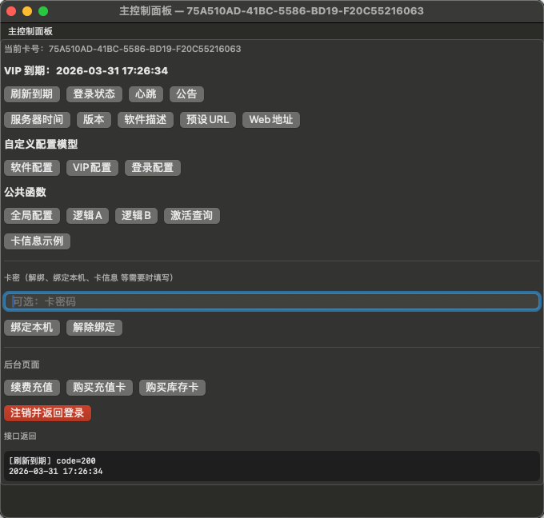
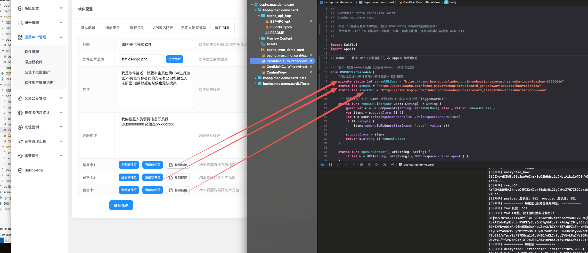
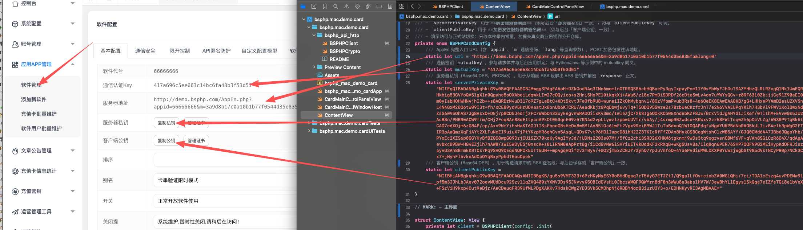

# BSPHP — bsphp.mac.demo.card（macOS 卡模式演示 App）

## 專案簡介

在 Mac 上演示 BSPHP 卡密／機器碼登入與控制台（SwiftUI）。與 **bsphp.mac.demo**（帳號模式）互補，專案獨立。

## 目錄結構

```
bsphp.mac.demo.card/
├── bsphp.mac.demo.card.xcodeproj/
├── bsphp.mac.demo.card/
│   ├── bsphp_mac_demo_cardApp.swift
│   ├── ContentView.swift              BSPHPCardConfig
│   ├── CardMainControlPanelView.swift BSPHPCardSaleWeb（daihao 等）
│   ├── bsphp_api_http/
│   ├── Assets.xcassets/
│   └── Preview Content/
├── bsphp.mac.demo.cardTests/
├── bsphp.mac.demo.cardUITests/
├── 效果图-配置说明/
├── 说明中文.md / 说明繁体.md / 说明英文.md
└── （建置產物在 DerivedData）
```

## 設定說明

1. `ContentView.swift` → **BSPHPCardConfig**。
2. `CardMainControlPanelView.swift` → **BSPHPCardSaleWeb** 與後台軟體代號一致。

## 執行

Xcode 開啟專案，**My Mac**。**Product → Show Build Folder in Finder**。

## 設定說明截圖










