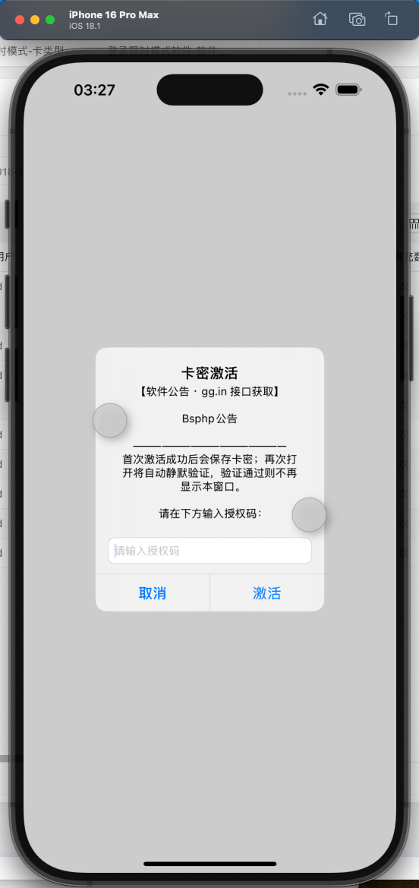
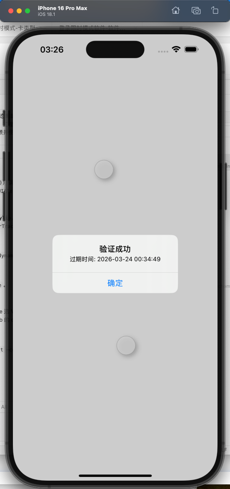
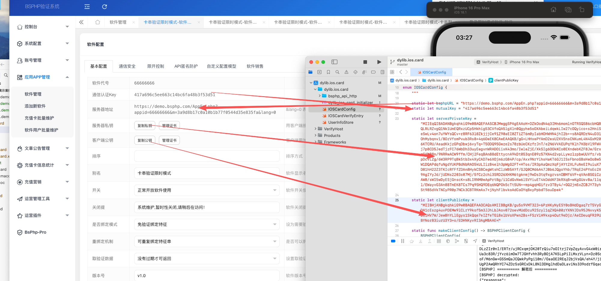
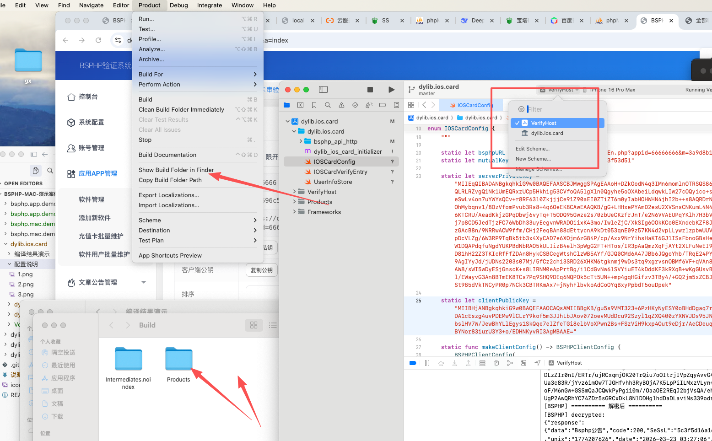

# BSPHP — dylib.ios.card (iOS card-verify dylib, Swift)

## Overview

iOS dylib for BSPHP card verification (Swift; `bsphp_api_http`). Integrate into your app or debug via **VerifyHost** + `dlopen`.

## Directory tree

```
dylib.ios.card/
├── dylib.ios.card.xcodeproj/  Schemes: dylib.ios.card, VerifyHost
├── dylib.ios.card/
│   ├── IOSCardConfig.swift    Server URL, keys, …
│   ├── IOSCardVerifyEntry.swift
│   ├── bsphp_api_http/
│   └── dylib_ios_card_initializer.m
├── VerifyHost/
├── 编译结果演示/
├── 配置说明/
└── 说明中文.md / 说明繁体.md / 说明英文.md
```

## Configuration

Edit **`dylib.ios.card/IOSCardConfig.swift`** so host, mutualKey, and RSA keys match your BSPHP app.

## Debug

1. Open `dylib.ios.card.xcodeproj`  
2. Scheme **VerifyHost** → Simulator or device  
3. ⌘R  

## Screenshots








