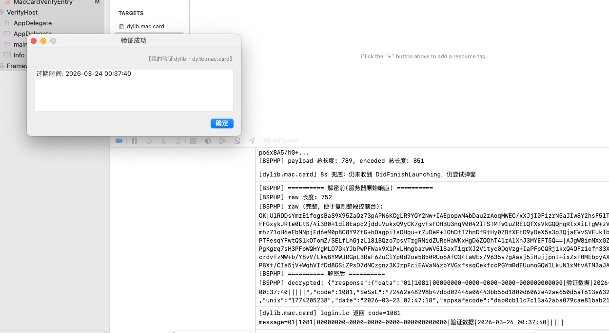
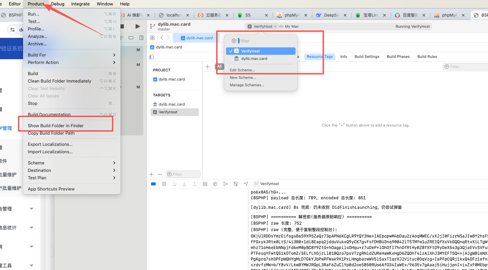
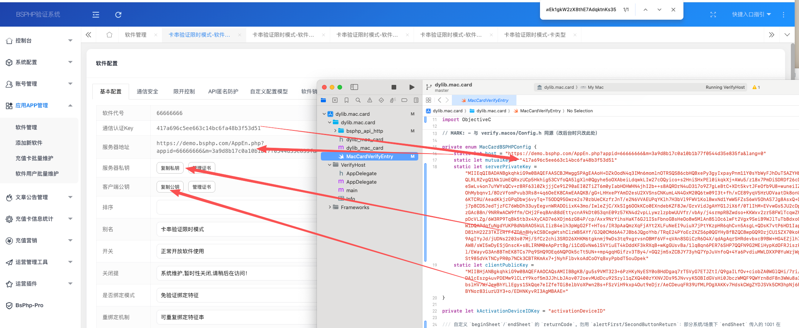

# BSPHP — dylib.mac.card（macOS 卡密驗證 dylib，Swift）

## 專案簡介

macOS 動態庫：BSPHP 卡密驗證（Swift，`bsphp_api_http` 負責網路與加解密）。載入後由 constructor 排隊，待 AppKit 就緒後走公告與卡密流程。細節見 **README.md**。

## 目錄結構

```
dylib.mac.card/
├── dylib.mac.card.xcodeproj/  Scheme：dylib.mac.card、VerifyHost
├── dylib.mac.card/
│   └── bsphp_api_http/
├── VerifyHost/
├── 编译结果演示/
├── 配置说明/
├── README.md
└── 说明中文.md / 说明繁体.md / 说明英文.md
```

## 產物名稱

動態庫：**`libdylib.mac.card.dylib`**。

## 設定說明

編輯 **`dylib.mac.card/MacCardVerifyEntry.swift`** 中私有列舉 **`MacCardBSPHPConfig`**。

## 偵錯（摘要）

1. 開啟 `dylib.mac.card.xcodeproj`  
2. Scheme：**VerifyHost**，目的地：**My Mac**  
3. ⌘R  

## 設定說明截圖







