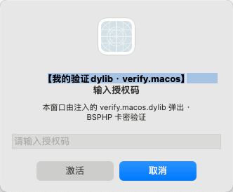
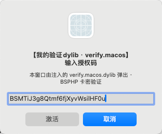
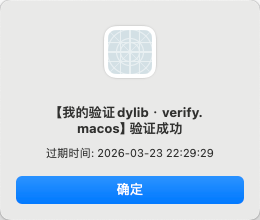
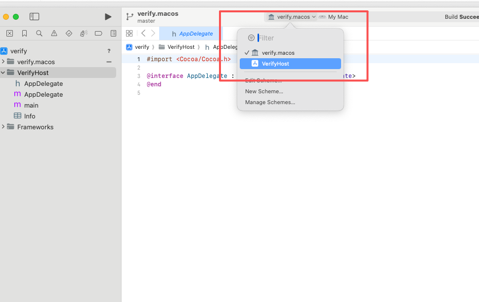
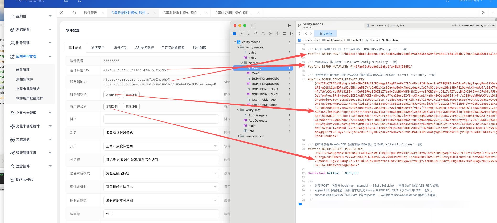

# BSPHP — dylib.verify.macos（macOS 動態庫 + VerifyHost）

## 專案簡介

macOS 動態庫：BSPHP 卡密協定（與 `dylib.verify.oc`／卡模式 Demo 一致），可用於 `dlopen` 測試或自行注入宿主。細節見 **说明.md**。

## 目錄結構

```
dylib.verify.macos/
├── verify.macos.xcodeproj/    Scheme：verify.macos、VerifyHost
├── verify.macos/
│   ├── entry.m
│   └── NetTool/               Config.h 等
├── VerifyHost/
├── 编译的结果/
├── 配置说明/
├── 说明.md
└── 说明中文.md / 说明繁体.md / 说明英文.md
```

## 設定說明

編輯 **`verify.macos/NetTool/Config.h`**：`BSPHP_HOST`、`BSPHP_MUTUALKEY`、RSA 相關巨集。

## 使用（摘要）

- 偵錯彈窗：Scheme **VerifyHost**，目的地 **My Mac**，⌘R。  
- 只編 dylib：Scheme **verify.macos**，**Product → Show Build Folder in Finder**。

## 設定說明截圖











