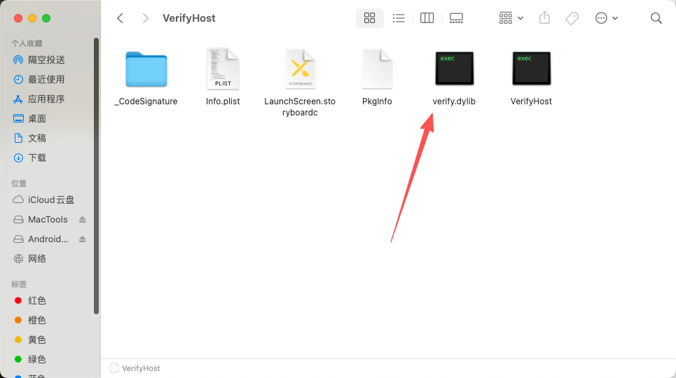
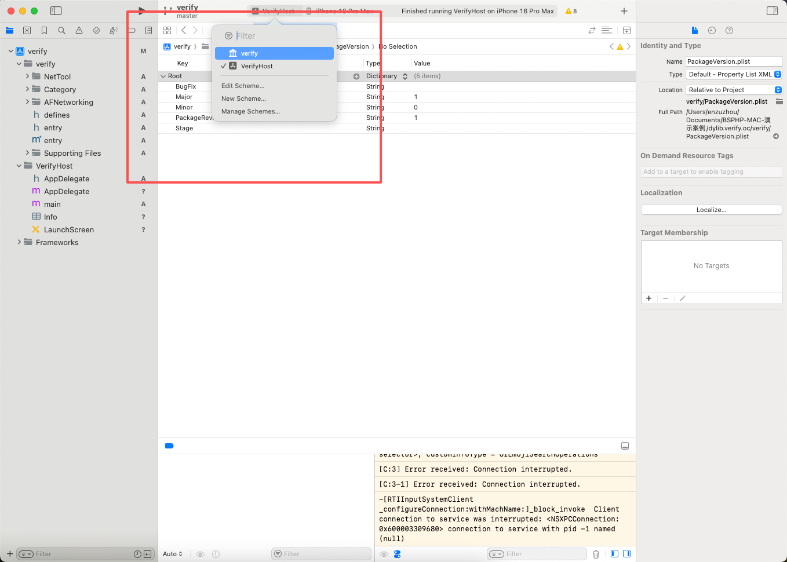
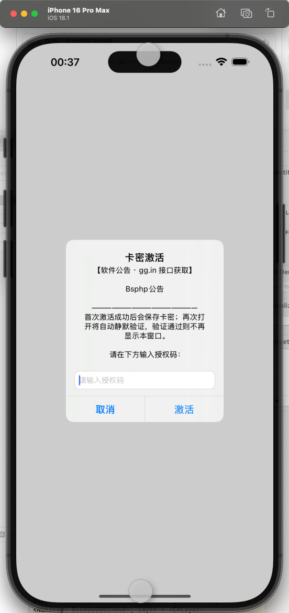
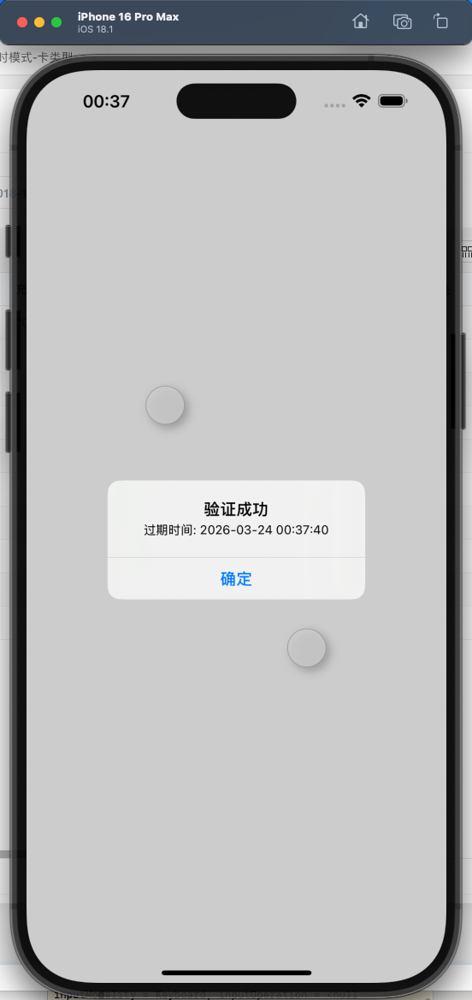
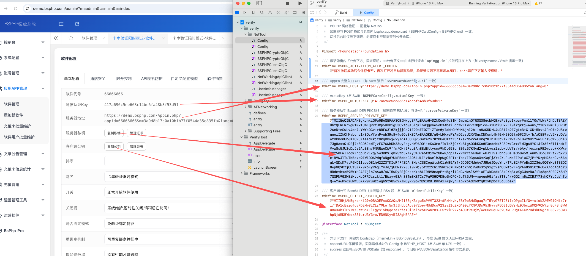

# BSPHP — dylib.verify.oc (iOS dylib + VerifyHost)

## Overview

iOS harness: `VerifyHost.app` dlopen’s `verify.dylib` in the bundle to debug constructor, networking, and UIKit alerts. See **说明.md**.

## Directory tree

```
dylib.verify.oc/
├── verify.xcodeproj/          Schemes: verify, VerifyHost
├── verify/
│   ├── entry.mm
│   ├── NetTool/               Config.h, …
│   ├── AFNetworking/
│   └── Category/
├── VerifyHost/
├── 编译好的测试/
├── 配置说明/
├── 说明.md
└── 说明中文.md / 说明繁体.md / 说明英文.md
```

## Configuration

Edit **`verify/NetTool/Config.h`**: `BSPHP_HOST`, `BSPHP_MUTUALKEY`, RSA macros.

## Debug

1. Open `verify.xcodeproj`  
2. Scheme **VerifyHost** → iOS Simulator or device  
3. ⌘R  

Dylib only: scheme **verify**.

## Screenshots











